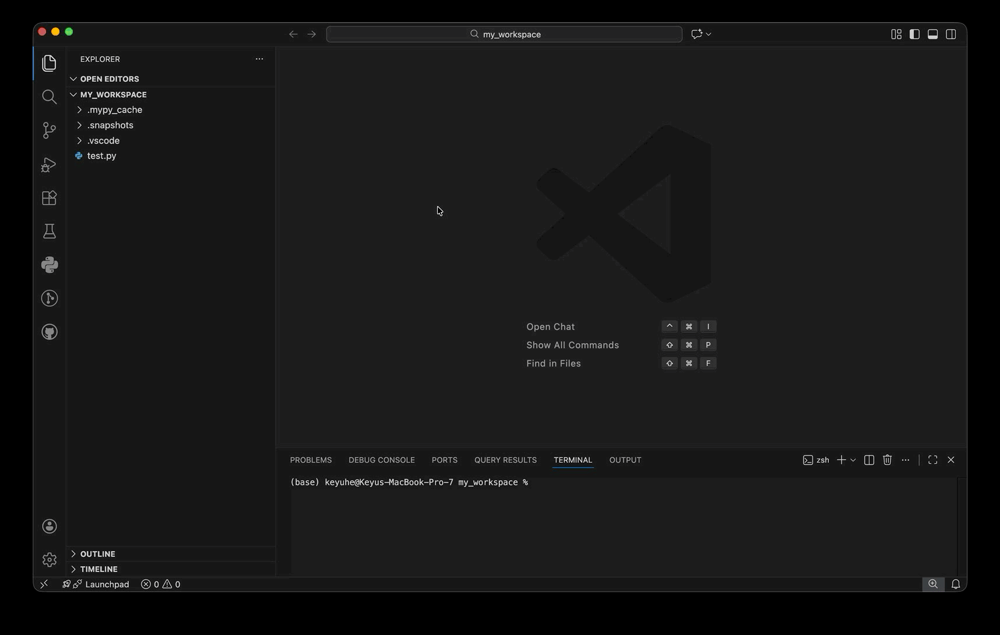
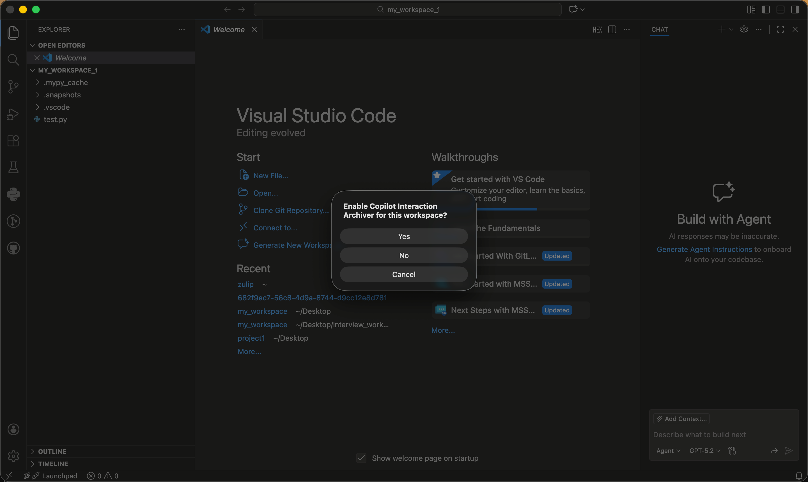
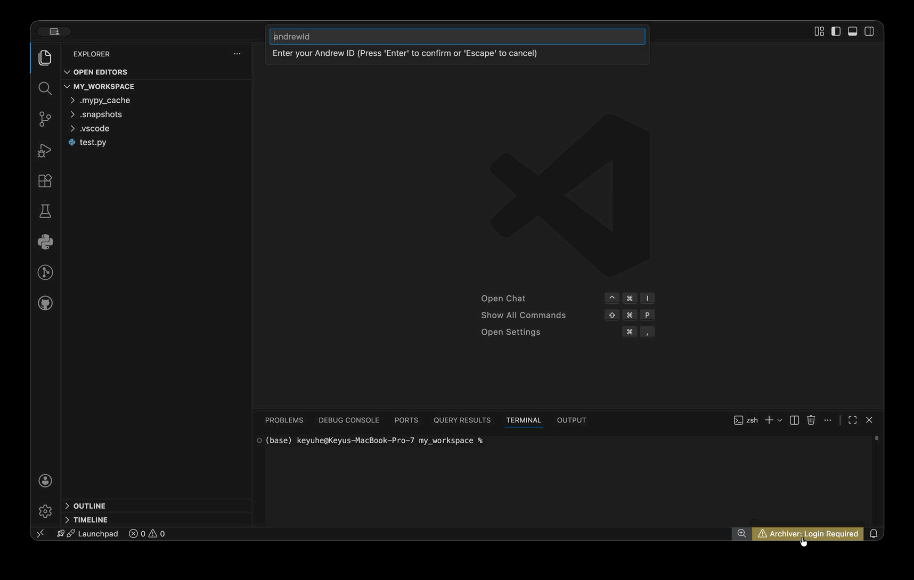
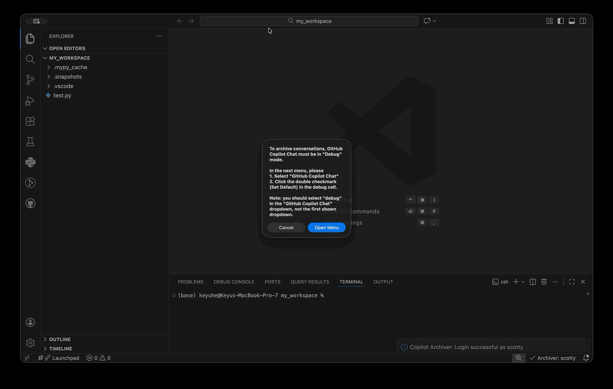
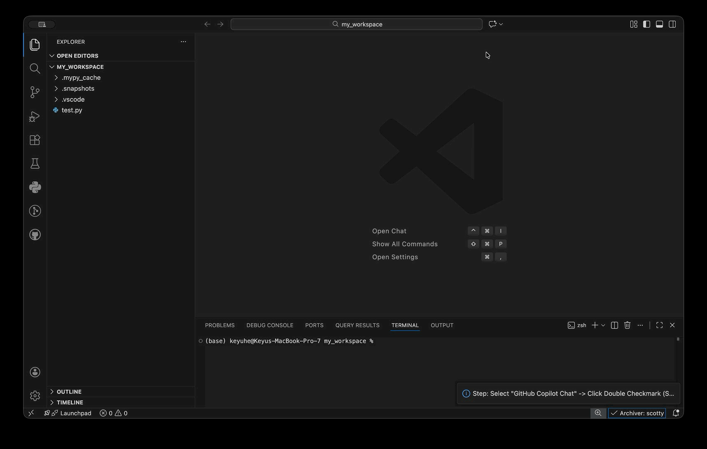

# RECAP

**RECAP** — *An End-to-End Platform for Capturing, Replaying, and Analyzing AI-Assisted Programming Interactions* (ACL 2026, System Demonstrations) — is a research tool that automatically captures and archives your interactions with GitHub Copilot, producing a detailed timeline of your coding session including chat logs and code snapshots. Formerly known as "Copilot Interaction Archiver".

The extension supports two modes:
- **Upload Mode** — uploads captures to a backend (used in CMU course deployments; requires an Andrew ID and class password).
- **Local Only Mode** — captures stay on your machine inside `.snapshots/` and `.archiver_shadow/`. No login or backend required. See [Local Only Mode](#local-only-mode-no-login) below.

The first time you enable the extension in a workspace, it will prompt you to pick one. You can switch modes any time from the status bar menu.

## Prerequisites
*   **VS Code** (v1.80.0 or higher)
*   **Node.js** (v18 or higher)
*   **Git**

## Usage Guide

### 1. Installation
1.  Click the **Extensions** icon in the left sidebar.
2.  Search for and install the **GitHub Copilot Chat** extension from the VS Code Marketplace.
3.  Search for and install the **Copilot Interaction Archiver** extension from the VS Code Marketplace.
4.  Reload the window. You can do this by `Cmd+Shift+P` / `Ctrl+Shift+P` and typing "Developer: Reload Window"; alternatively, you can just quit VS Code (`Cmd+Q` / `Alt+F4`) and reopen it.

<!--  -->

### 2. Activation for Workspace
When you open a folder/workspace for the first time, you will see a notification:
> "Enable Copilot Interaction Archiver for this workspace?"

<!--  -->

1.  Click **Yes**.
2.  This ensures the archiver only runs on course-related projects.

*If you missed the prompt or need to re-enable it:*
- Open the Command Palette (`Cmd+Shift+P` / `Ctrl+Shift+P`).
- Run: **`Copilot Archiver: Enable for this Workspace`**.

### 3. Log In (Upload Mode)
1.  Open Command Palette (`Cmd+Shift+P` / `Ctrl+Shift+P`).
2.  Run: **`Copilot Archiver: Login`**.
3.  Enter your **Andrew ID**.
4.  Enter the **Class Password**.

> If you do not have credentials, you can use [Local Only Mode](#local-only-mode-no-login) instead — everything is captured locally and nothing is uploaded.

<!--  -->

### 4. Enable Debug Logging
For the extension to better capture the interactions, **GitHub Copilot Chat should be in Debug mode**.

1.  Open Command Palette (`Cmd+Shift+P` / `Ctrl+Shift+P`).
2.  Run: **`Copilot Archiver: Enable Copilot Debug Logging`**.
3.  A modal will appear explaining the steps. Click **Open Menu**.
4.  In the menu that appears at the top:
    - Select **"GitHub Copilot Chat"**.
    - Click the **Double Checkmark (Set as Default)** icon next to "**Debug**".

<!--  -->

### 5. Coding & Verification
- If you see the status bar item `⎷ Archiver: <YourID>`, everything is working!
- You can start coding on your homeworks as normal.

> [!TIP] To use the **Copilot Chat**, click the ``Toggle Chat`` button near the search bar on the top of the editor. This will open the chat panel. 

> [!TIP] Every time you open a new workspace, the extension will ask you if you want to enable it. Select **Yes** for course projects.

<!--  -->

### 6. Final Snapshot
- When you are ready to turn in your assignment, please open the **Archiver Menu** (click the status bar item) and select **Capture Repo Snapshot**.

> [!WARNING]
> This uploads your code for **research data collection only**. You must still submit your homework for grading according to the course instructions.

---

## Local Only Mode (No Login)

If you don't have credentials — or you just want to use the archiver as a personal coding-history tool — pick **Local Only** when prompted (or click the status bar item and choose **Use Local Only** / **Switch to Local Only Mode**).

In Local Only mode:
- The extension never contacts the backend.
- Nothing is uploaded to S3.
- All captures still happen on your machine: chat sessions land in `.snapshots/`, file edits are committed to a hidden git repo at `.archiver_shadow/`, and manual snapshots include a copy of the current workspace.
- You can browse the captured timeline locally with `replay_app/replay_server.py`.

You can switch back to Upload Mode any time by clicking the status bar item and choosing **Switch to Upload Mode** (which triggers the login flow).

You can also flip the mode directly via the setting `copilotArchiver.localMode`.

---

## Data Privacy & Storage
Your data is stored securely:
- **Local**: Inside `.snapshots/` and `.archiver_shadow/` in your workspace
> [!WARNING]
> Please do not move / delete files in these two folders. They are necessary for tracking your interactions.
- **Cloud**: Uploaded to a private, secure S3 bucket managed by the course staff.

---

## Maintainers

| Keyu He | Qianou Ma |
| :---: | :---: |
|        |        |
